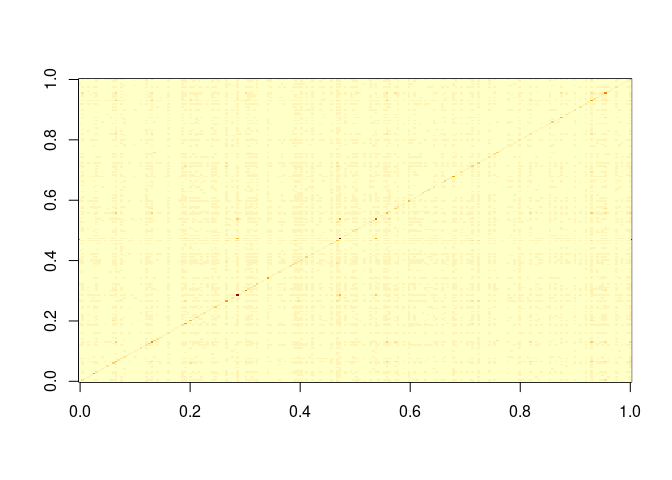

# auxPort

The package auxPort provides various functions necessary fo cleaning
stock data, optimizing portfolios, and evaluating their performance.

## Installation

You can install this version of the package from Github with:

``` r
install.packages("devtools")
library(devtools)
install_github("antshi/auxPort")
```

## Examples

These are basic examples to show you how to use the some of the
functionality.

## Example 1: Data Cleaning

``` r
library(auxPort)
```

    ## Warning: replacing previous import 'CVXR::constraints<-' by 'ROI::constraints<-'
    ## when loading 'auxPort'

    ## Warning: replacing previous import 'CVXR::objective<-' by 'ROI::objective<-'
    ## when loading 'auxPort'

    ## Warning: replacing previous import 'CVXR::constraints' by 'ROI::constraints'
    ## when loading 'auxPort'

    ## Warning: replacing previous import 'CVXR::objective' by 'ROI::objective' when
    ## loading 'auxPort'

``` r
dates <-  as.Date(sp500[,1], format="%d.%m.%Y", stringsAsFactors=FALSE)
find_weekends(dates)
```

    ## integer(0)

``` r
prices <- as.matrix(sp500[,-1])
find_nas(prices, all=FALSE)
```

    ## JEFFERSON.PILOT.DEAD...21.04.06 
    ##                             235

``` r
find_nas(prices, all=TRUE)
```

    ## integer(0)

## Example 2: Portfolio Optimization

``` r
returns <- sp500_rets[,-1]
Sigma <- cov(returns)
naive <- port_estim_naive(Sigma)
gmv <- port_estim_gmv(Sigma)
gmv_lasso <- port_estim_solver(Sigma, lambda1=0.0001)
matplot(cbind(naive, gmv, gmv_lasso), type="l", col=c("black", "green", "darkgreen"), lty=1, lwd=1, ylab="Weights")
legend("topleft", legend=c("Naive", "GMV", "GMV-lasso"), col=c("black", "green", "darkgreen"), lty=1, lwd=1)
```

<!-- -->
